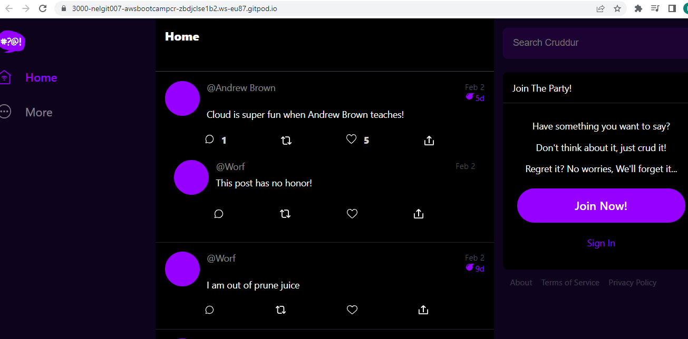

# Week 1 — App Containerization

## Backend App Containerization


### Step 1


I ran Python using the following commands:


```sh
pip install -r requirements.txt
```


Then
```sh
cd backend-flask
export FRONTEND_URL="*"
export BACKEND_URL="*"
python3 -m flask run --host=0.0.0.0 --port=4567
cd ..
```


### Step 2

I ensured the port was open

I proceeded to append the url `/api/activities/home` to the link opened on my browser:

See outcome below;


I then stopped the running application, then unset the Backend and Frontend URL's


### Step 3


I Created a docker file for the backend app @ `backend-flask/Dockerfile`

```dockerfile
FROM python:3.10-slim-buster

WORKDIR /backend-flask

COPY requirements.txt requirements.txt
RUN pip3 install -r requirements.txt

COPY . .

ENV FLASK_ENV=development

EXPOSE ${PORT}
CMD [ "python3", "-m" , "flask", "run", "--host=0.0.0.0", "--port=4567"]
```


### Build Container For Backend Application

From the application dir, I ran the following command to build the container image defined in the docker file above;

```sh
docker build -t  backend-flask ./backend-flask
```

RUN, to run the image
```sh
docker run --rm -p 4567:4567 -it -e FRONTEND_URL='*' -e BACKEND_URL='*' backend-flask
```

### Sending Curl to Test Server


I sent the following request to test the server on port 4567

```sh
curl -X GET http://localhost:4567/api/activities/home -H "Accept: application/json" -H "Content-Type: application/json"
```

Here is how my containerized Backend Application looks:


### To Gain Access to the Container


I ran the following commmand:

```sh
docker exec <CONTAINER_ID> -it /bin/bash
```

### Delete Image

I removed built image with: 
```sh
docker image rm backend-flask
```

NB: To forcefully remove image run
```sh
docker image rm backend-flask --force
```


## Containerizing Frontend of Cruddur Application

### Run NPM Install

I had to run NPM Install before building the container since it needs to copy the contents of node_modules

```
cd frontend-react-js
npm i
```

### Create Docker File

I Created a dockerfile for the frontend app @: `frontend-react-js/Dockerfile`

```dockerfile
FROM node:16.18

ENV PORT=3000

COPY . /frontend-react-js
WORKDIR /frontend-react-js
RUN npm install
EXPOSE ${PORT}
CMD ["npm", "start"]
```

### Build the Container


RUN
```sh
docker build -t frontend-react-js ./frontend-react-js
```

### To Run the Container

```sh
docker run -p 3000:3000 -d frontend-react-js
```

## Multiple Containers

To run multiple containers, I created a docker-compose.yaml file

### Creating a docker-compose file

I Created a `docker-compose.yml` at the root of my project.

```yaml
version: "3.8"
services:
  backend-flask:
    environment:
      FRONTEND_URL: "https://3000-${GITPOD_WORKSPACE_ID}.${GITPOD_WORKSPACE_CLUSTER_HOST}"
      BACKEND_URL: "https://4567-${GITPOD_WORKSPACE_ID}.${GITPOD_WORKSPACE_CLUSTER_HOST}"
    build: ./backend-flask
    ports:
      - "4567:4567"
    volumes:
      - ./backend-flask:/backend-flask
  frontend-react-js:
    environment:
      REACT_APP_BACKEND_URL: "https://4567-${GITPOD_WORKSPACE_ID}.${GITPOD_WORKSPACE_CLUSTER_HOST}"
    build: ./frontend-react-js
    ports:
      - "3000:3000"
    volumes:
      - ./frontend-react-js:/frontend-react-js

# the name flag is a hack to change the default prepend folder
# name when outputting the image names
networks: 
  internal-network:
    driver: bridge
    name: cruddur
```

I ran the command

```sh
docker-compose up
```

Here is how my catainerized app looks:




## Important Docker CMDs

### Sending Curl to Test Server

```sh
curl -X GET http://localhost:4567/api/activities/home -H "Accept: application/json" -H "Content-Type: application/json"
```

### Checking Container Logs

```sh
docker logs CONTAINER_ID -f
docker logs backend-flask -f
docker logs $CONTAINER_ID -f
```

###  Debugging  adjacent containers with other containers

```sh
docker run --rm -it curlimages/curl "-X GET http://localhost:4567/api/activities/home -H \"Accept: application/json\" -H \"Content-Type: application/json\""
```

busybosy is often used for debugging since it install a bunch of thing

```sh
docker run --rm -it busybosy
```

### Gaining Access to a Container

```sh
docker exec CONTAINER_ID -it /bin/bash
```

> You can just right click a container and see logs in VSCode with Docker extension


### Delete an Image

```sh
docker image rm backend-flask --force
```

> docker rmi backend-flask is the legacy syntax, you might see this is old docker tutorials and articles.

> There are some cases where you need to use the --force

### Overriding Ports

```sh
FLASK_ENV=production PORT=8080 docker run -p 4567:4567 -it backend-flask
```


## Adding DynamoDB Local and Postgres

Oweing to the fact that Postgres and DynamoDB local would be a requirement for future labs
I have been tasked to can bring them in as containers and reference them externally.

Integrating the following into the existing docker-compose.yaml file:

### Postgres

Adding a new DB service.

```yaml
services:
  db:
    image: postgres:13-alpine
    restart: always
    environment:
      - POSTGRES_USER=postgres
      - POSTGRES_PASSWORD=password
    ports:
      - '5432:5432'
    volumes: 
      - db:/var/lib/postgresql/data
volumes:
  db:
    driver: local
```

I added the following command to my gitpod.yaml file to install the postgres client into Gitpod

```sh
  - name: postgres
    init: |
      curl -fsSL https://www.postgresql.org/media/keys/ACCC4CF8.asc|sudo gpg --dearmor -o /etc/apt/trusted.gpg.d/postgresql.gpg
      echo "deb http://apt.postgresql.org/pub/repos/apt/ `lsb_release -cs`-pgdg main" |sudo tee  /etc/apt/sources.list.d/pgdg.list
      sudo apt update
      sudo apt install -y postgresql-client-13 libpq-dev
```


### DynamoDB Local

```yaml
services:
  dynamodb-local:
    # https://stackoverflow.com/questions/67533058/persist-local-dynamodb-data-in-volumes-lack-permission-unable-to-open-databa
    # We needed to add user:root to get this working.
    user: root
    command: "-jar DynamoDBLocal.jar -sharedDb -dbPath ./data"
    image: "amazon/dynamodb-local:latest"
    container_name: dynamodb-local
    ports:
      - "8000:8000"
    # We are mapping docker dynamo DB to the local dir, we are storing data over
    volumes:
      - "./docker/dynamodb:/home/dynamodblocal/data"
    working_dir: /home/dynamodblocal
```

### Added a Database explorer from vscode extention and tested the state of my DB.

I set up the postgres and DynamoDB to ensure it was runnig.

I carried out some test using a Database Explorer. 

Because I ran the postgresql-server in docker with port binding using, I had to tell psql to use TCP-socket with:


```sh
psql Upostgres --host locallhost
```

See my result below:


More Example of using DynamoDB local
https://github.com/100DaysOfCloud/challenge-dynamodb-local

## Volumes

directory volume mapping

```yaml
volumes: 
- "./docker/dynamodb:/home/dynamodblocal/data"
```

named volume mapping

```yaml
volumes: 
  - db:/var/lib/postgresql/data

volumes:
  db:
    driver: local
```


### Some Docker Best Practise

**BEST PRACTISES**

- A best practice is to include multiple run command as part of a single run instruction, - all glued together with double  ampersand (&&) and backlash \**.

- Leverage the build cache

- 


